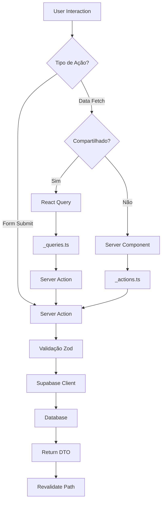

# 🔍 Review Técnica: Nova Arquitetura EasyDrive

**Reviewer:** Especialista Next.js  
**Data:** 2026-01-04  
**Versão Avaliada:** Arquitetura Simplificada

---

## 📊 Avaliação Geral

| Critério                      | Nota             | Comentário                                       |
| ----------------------------- | ---------------- | ------------------------------------------------ |
| **Alinhamento com Next.js**   | ⭐⭐⭐⭐ (4/5)   | Muito bem alinhado, pequenos ajustes necessários |
| **Escalabilidade**            | ⭐⭐⭐⭐⭐ (5/5) | Excelente estrutura para crescimento             |
| **Manutenibilidade**          | ⭐⭐⭐⭐ (4/5)   | Boa, mas pode melhorar em alguns pontos          |
| **Performance**               | ⭐⭐⭐⭐⭐ (5/5) | Server-first approach é ótimo                    |
| **DX (Developer Experience)** | ⭐⭐⭐⭐ (4/5)   | Intuitivo, mas requer documentação clara         |

**Nota Final: 4.4/5** ✅ **Arquitetura Sólida e Recomendada**

---

## ✅ Pontos Fortes

### 1. **Excelente Adoção do App Router**

```typescript
✅ Server Components por padrão
✅ Server Actions ao invés de API Routes
✅ Streaming e Suspense nativos
✅ Route Groups para organização lógica
```

**Comentário:** A arquitetura abraça completamente o modelo do App Router. O uso de Server Actions é especialmente bem-vindo, evitando a overhead de API Routes para comunicação interna.

### 2. **Colocation Inteligente**

```
✅ Código próximo de onde é usado
✅ Prefixo _ para privacidade
✅ Estrutura flat (3-4 níveis vs 7-8 anterior)
```

**Comentário:** A estratégia de colocation reduz drasticamente o "context switching". Desenvolvedores não precisam navegar por múltiplas pastas para entender uma feature.

### 3. **Separação Lógica/UI com Hooks**

```typescript
_components/  → UI pura
_hooks/       → Lógica de estado
_actions.ts   → Backend logic
```

**Comentário:** Excelente separação de responsabilidades. Componentes limpos são mais fáceis de ler e manter. Hooks customizados promovem reusabilidade.

### 4. **Performance-First**

```typescript
✅ Server Components maximizados
✅ Client Components apenas quando necessário
✅ Streaming e loading states nativos
✅ Revalidation com Server Actions
```

**Comentário:** A arquitetura favorece performance por padrão. O bundle JavaScript do cliente será significativamente menor.

### 5. **Type Safety com DTOs**

```typescript
✅ DTOs para isolar database schema
✅ Validação Zod em todas entradas
✅ Types gerados automaticamente do Supabase
```

**Comentário:** Excelente proteção contra vazamento de dados e mudanças no banco. DTOs são essenciais em aplicações sérias.

---

## ⚠️ Pontos de Atenção

### 1. **Possível Overhead de `_hooks/` em Casos Simples**

**Problema Identificado:**

```typescript
// Para um componente muito simples:
_components/SimpleButton.tsx  → Apenas um botão
_hooks/useSimpleButton.ts     → Overkill para lógica trivial?
```

**Recomendação:**

```typescript
✅ Use _hooks/ quando:
- Lógica complexa (validação, estado múltiplo)
- Lógica reutilizável em 2+ componentes
- Side effects não-triviais

❌ Evite _hooks/ para:
- useState simples
- Toggle booleano
- Lógica de apresentação pura
```

**Sugestão de Ajuste:**

```typescript
// Para casos simples, OK ter lógica no componente:
"use client";
export function SimpleCounter() {
  const [count, setCount] = useState(0);
  return <button onClick={() => setCount((c) => c + 1)}>{count}</button>;
}

// Para casos complexos, extrair para hook:
export function ComplexForm() {
  const { form, errors, handleSubmit, validate, isPending } = useComplexForm();
  // Hook justificado pela complexidade
}
```

### 2. **`_types.ts` por Rota Pode Duplicar Código**

**Problema Identificado:**

```
app/(app)/profile/_types.ts
app/(app)/settings/_types.ts
app/(app)/dashboard/_types.ts

→ Se todos usam UserPublicDTO, está duplicado?
```

**Recomendação:**

```typescript
✅ Use lib/types/ para types compartilhados:
lib/types/
  ├── database.ts       # Gerado do Supabase
  └── common.ts         # Types usados em 3+ lugares

✅ Use app/*/_types.ts apenas para types LOCAL:
app/(app)/profile/_types.ts
  // Apenas types DESTA rota específica
  export type ProfileFormState = {...}
```

**Princípio:** "Types compartilhados → `lib/types/`, Types locais → `_types.ts`"

### 3. **Nomenclatura de Route Groups Pode ser Melhorada**

**Atual:**

```
app/
  ├── (landing-page)/   # OK, mas pode confundir
  ├── (app)/            # Muito genérico
  └── auth/             # Não está em route group
```

**Sugestão Alternativa:**

```
app/
  ├── (public)/         # ou (marketing), (web)
  │   ├── page.tsx      # Landing page
  │   └── about/        # Sobre
  │
  ├── (authenticated)/  # ou (dashboard), (platform)
  │   ├── dashboard/
  │   ├── profile/
  │   └── ...
  │
  └── (auth)/           # Consistente com o padrão
      ├── login/
      └── sign-up/
```

**Justificativa:**

- `(public)` é mais claro que `(landing-page)` (que implica apenas 1 página)
- `(authenticated)` é mais descritivo que `(app)`
- `(auth)` em route group alinha com o padrão

### 4. **React Query pode ser Subutilizado**

**Atual:**

```typescript
// _queries.ts existe mas não é claro quando usar
```

**Recomendação:**

Documentar claramente quando usar cada approach:

```typescript
✅ Server Actions (direto no componente):
- Mutations simples (forms)
- Não precisa de cache
- Dados únicos (não compartilhados)

✅ React Query (_queries.ts):
- Dados compartilhados entre componentes
- Polling/refetching automático
- Optimistic updates complexos
- Cache e sincronização entre telas
```

**Exemplo:**

```typescript
// ❌ Não use React Query para form simples:
function ProfileForm() {
  const mutation = useMutation({ ... }); // Overkill
  return <form action={updateProfile}>   // Server Action é melhor
}

// ✅ Use React Query para dados compartilhados:
function Dashboard() {
  const { data: user } = useUser();      // Cache compartilhado
  return <ProfileHeader user={user} />   // Múltiplos componentes usam
}
```

### 5. **Falta Convenção para Assets/Static Files**

**Não documentado:**

```
Onde colocar:
- Imagens de uma rota específica?
- SVGs customizados?
- Dados mock para desenvolvimento?
```

**Sugestão:**

```
app/(app)/profile/
  ├── _assets/          # Imagens, SVGs desta rota
  ├── _components/
  ├── _hooks/
  └── _actions.ts

public/
  ├── images/           # Imagens globais
  └── icons/            # Ícones compartilhados

lib/
  └── mocks/            # Dados mock p/ dev (dev-only)
```

---

## 🚀 Recomendações de Melhoria

### 1. **Adicionar Padrão para Error Handling**

```typescript
// app/(app)/profile/_errors.ts
export class ProfileNotFoundError extends Error {
  constructor() {
    super("Perfil não encontrado");
    this.name = "ProfileNotFoundError";
  }
}

// app/(app)/profile/error.tsx
("use client");
export default function ProfileError({ error, reset }) {
  return <ErrorBoundary error={error} reset={reset} />;
}
```

### 2. **Convencionar Loading States**

```typescript
// app/(app)/profile/loading.tsx
export default function ProfileLoading() {
  return <ProfileSkeleton />;
}

// Ou usar Suspense boundaries:
<Suspense fallback={<ProfileSkeleton />}>
  <ProfileContent />
</Suspense>;
```

### 3. **Adicionar Padrão para Metadata**

```typescript
// app/(app)/profile/metadata.ts
import { Metadata } from "next";

export const metadata: Metadata = {
  title: "Perfil",
  description: "Gerencie seu perfil",
};

// Ou generateMetadata para dinâmico:
export async function generateMetadata({ params }): Promise<Metadata> {
  const user = await getUser(params.id);
  return {
    title: `Perfil de ${user.name}`,
  };
}
```

### 4. **Documentar Padrão de Testes**

```
app/(app)/profile/
  ├── __tests__/        # ou .test.tsx adjacentes
  │   ├── ProfileForm.test.tsx
  │   └── page.test.tsx
  ├── _components/
  ├── _hooks/
  │   └── useProfileForm.test.ts  # Testes de hooks
  └── _actions.test.ts            # Testes de Server Actions
```

### 5. **Considerar `_lib/` para Utils Locais**

```typescript
app/(app)/profile/
  ├── _lib/             # Utils locais desta rota
  │   ├── formatters.ts
  │   └── validators.ts
  ├── _components/
  └── _actions.ts
```

---

## 🎯 Comparação com Padrões da Comunidade

### vs. Vercel's App Router Examples

**Semelhanças (✅ Bom):**

- Route groups para organização
- Server Components first
- Server Actions para mutations
- Colocation de componentes

**Diferenças:**

- Vercel usa menos `_hooks/` separados (mais inline)
- Vercel tem `(group)/actions.ts` global por grupo às vezes
- Nossa arquitetura tem mais estrutura (pode ser bom ou ruim)

**Veredito:** Nossa arquitetura é **mais estruturada** que os exemplos da Vercel. Isso é **positivo para projetos maiores**, mas pode ser overkill para MVPs.

### vs. T3 Stack

**Semelhanças:**

- Type safety (TypeScript strict)
- tRPC equivalente → Server Actions
- Validação Zod

**Diferenças:**

- T3 usa tRPC (procedimentos remotos)
- Nossa é mais simples (Server Actions nativos)
- T3 não tem padrão de `_hooks/` explícito

**Veredito:** Nossa arquitetura é **mais nativa do Next.js** e evita dependências extras (tRPC). Boa escolha.

### vs. Bulletproof React

**Semelhanças:**

- Feature-based (mas agora route-based)
- Separação de responsabilidades
- DTOs/Types isolados

**Diferenças:**

- Bulletproof é mais front-end focused
- Nossa é fullstack (Server Actions)

**Veredito:** Adaptamos bem o padrão Bulletproof para **Next.js fullstack**.

---

## 📐 Diagrama: Fluxo de Dados Recomendado



---

## 🧪 Teste de Estresse: Cenários Reais

### Cenário 1: Feature Complexa (Agendamento de Aulas)

```
app/(app)/lessons/
  ├── page.tsx                    # ✅ Lista de aulas
  ├── new/
  │   ├── page.tsx                # ✅ Criar nova aula
  │   ├── _components/
  │   │   ├── LessonForm.tsx      # ✅ Form complexo
  │   │   ├── InstructorPicker.tsx
  │   │   └── TimePicker.tsx
  │   ├── _hooks/
  │   │   ├── useLessonForm.ts    # ✅ Lógica do form
  │   │   └── useAvailability.ts  # ✅ Check disponibilidade
  │   └── _actions.ts             # ✅ createLesson
  ├── [id]/
  │   ├── page.tsx
  │   ├── edit/
  │   └── _components/
  ├── _components/                # ✅ Shared components
  │   └── LessonCard.tsx
  └── _queries.ts                 # ✅ React Query (se necessário)
```

**Avaliação:** ✅ **Escala muito bem.** Estrutura se mantém clara mesmo com feature complexa.

### Cenário 2: Dados Compartilhados (User Profile)

```
lib/
  ├── dtos/
  │   └── user.dto.ts             # ✅ DTOs compartilhados
  └── validations/
      └── user.ts                 # ✅ Validações compartilhadas

app/(app)/
  ├── profile/
  │   ├── _actions.ts             # getUserProfile
  │   └── ...
  ├── settings/
  │   ├── _actions.ts             # updateUserSettings
  │   └── ...
  └── dashboard/
      ├── _components/
      │   └── UserGreeting.tsx    # ✅ Usa lib/dtos/user.dto.ts
      └── ...
```

**Avaliação:** ✅ **Bem resolvido.** DTOs em `lib/` evitam duplicação.

### Cenário 3: Real-time Features (Chat)

```
app/(app)/chat/
  ├── page.tsx
  ├── [id]/
  │   ├── page.tsx
  │   ├── _components/
  │   │   ├── MessageList.tsx
  │   │   └── MessageInput.tsx
  │   ├── _hooks/
  │   │   └── useRealtimeMessages.ts  # ✅ Supabase realtime
  │   └── _actions.ts                 # sendMessage
  └── _hooks/
      └── usePresence.ts                # ✅ Online status
```

**Avaliação:** ✅ **Funciona bem.** `_hooks/` é perfeito para lógica realtime.

---

## 🔧 Ajustes Finais Recomendados

### 1. **Renomear Route Groups (opcional mas recomendado)**

```diff
- app/(landing-page)/
- app/(app)/
+ app/(public)/
+ app/(authenticated)/
+ app/(auth)/
```

### 2. **Documentar Quando Usar `_hooks/`**

Adicionar na documentação:

```markdown
## Quando Criar Hook Customizado?

✅ Criar hook SE:

- Lógica de estado complexa (3+ useState)
- Validação client-side customizada
- Side effects não-triviais (timers, subscriptions)
- Lógica reutilizada em 2+ componentes

❌ NÃO criar hook para:

- useState simples (<= 2 states)
- Toggle on/off simples
- Lógica inline trivial
```

### 3. **Adicionar Convenção de Assets**

```
app/(app)/profile/
  ├── _assets/          # NOVO: assets locais
  ├── _components/
  ├── _hooks/
  └── _actions.ts
```

### 4. **Documentar Error Handling**

```typescript
// Padrão de _errors.ts
app/(app)/profile/
  ├── _errors.ts        # NOVO: custom errors
  ├── error.tsx         # Error boundary
  └── ...
```

### 5. **Adicionar Template/Example**

Criar um `_template/` com estrutura completa de exemplo:

```
ai/templates/
  └── new-route/
      ├── page.tsx.example
      ├── _components/
      │   └── ExampleComponent.tsx
      ├── _hooks/
      │   └── useExample.ts
      ├── _actions.ts.example
      └── README.md         # Como usar este template
```

---

## 📊 Scorecard Final Detalhado

| Aspecto                 | Nota | Justificativa                                       |
| ----------------------- | ---- | --------------------------------------------------- |
| **Estrutura de Pastas** | 5/5  | Limpa, flat, intuitiva                              |
| **Alinhamento Next.js** | 4/5  | Excelente, pequenos ajustes em route groups         |
| **Type Safety**         | 5/5  | DTOs + Zod + TypeScript strict                      |
| **Performance**         | 5/5  | Server-first, otimizado por padrão                  |
| **Escalabilidade**      | 5/5  | Escala horizontalmente muito bem                    |
| **Reusabilidade**       | 4/5  | Boa com hooks, pode melhorar documentação           |
| **Testabilidade**       | 4/5  | Estrutura favorece testes, falta padrão documentado |
| **DX**                  | 4/5  | Intuitivo, mas requer aprendizado inicial           |
| **Manutenibilidade**    | 5/5  | Código próximo, fácil de encontrar                  |
| **Segurança**           | 5/5  | DTOs + validação em layers                          |

**Média: 4.6/5** 🏆

---

## ✅ Conclusão e Recomendação Final

### Veredito: **APROVADA COM PEQUENOS AJUSTES** ✅

Esta arquitetura é **sólida, moderna e bem fundamentada**. Está significativamente melhor que a arquitetura anterior e alinhada com as melhores práticas do Next.js 14+.

### Principais Forças:

1. ✅ Server-first approach
2. ✅ Colocation inteligente
3. ✅ Separação lógica/UI clara
4. ✅ Type safety robusto
5. ✅ Escalável e manutenível

### Ajustes Sugeridos (Prioridade):

#### 🔴 Alta Prioridade:

1. Documentar quando usar `_hooks/` vs lógica inline
2. Adicionar convenção de error handling
3. Documentar padrão de testes

#### 🟡 Média Prioridade:

4. Considerar renomear route groups (`(public)`, `(authenticated)`)
5. Adicionar convenção para assets locais
6. Documentar quando usar React Query vs Server Actions

#### 🟢 Baixa Prioridade:

7. Criar templates de exemplo
8. Adicionar metadata patterns
9. Documentar loading states patterns

### Próximos Passos Recomendados:

1. **Aprovar arquitetura base** (já está excelente)
2. **Implementar ajustes de alta prioridade** na documentação
3. **Migrar uma feature simples** como POC
4. **Validar padrões** com o time
5. **Iterar** com base no feedback real

---

## 📚 Recursos para Aprofundamento

- [Next.js App Router Docs](https://nextjs.org/docs/app)
- [Server Actions Best Practices](https://nextjs.org/docs/app/building-your-application/data-fetching/server-actions-and-mutations#best-practices)
- [Route Groups](https://nextjs.org/docs/app/building-your-application/routing/route-groups)
- [Private Folders](https://nextjs.org/docs/app/building-your-application/routing/colocation#private-folders)
- [Vercel Next.js Examples](https://github.com/vercel/next.js/tree/canary/examples)

---

**Assinado:** Paulo (Next.js Expert Review)  
**Data:** 2026-01-04
