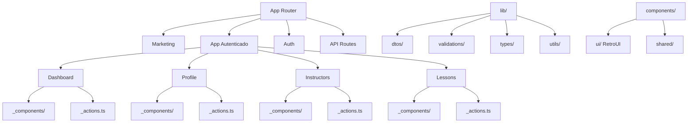

# 🏗️ Plano: Simplificação da Arquitetura do EasyDrive

## 📋 Contexto

A arquitetura atual do projeto está fragmentada demais, com estrutura de pastas complexa que dificulta:

- Localização de arquivos (front vs back)
- Navegação do projeto (muitos níveis de profundidade)
- Entendimento por desenvolvedores e IA
- Não segue os padrões nativos do Next.js 14+

### Problemas Identificados

#### 1. **Duplicação de API Routes**

```
❌ Estado Atual:
features/users/api/       → API específica da feature
app/api/users/           → API Routes do Next.js

→ Confusão: onde criar novas APIs?
```

#### 2. **Estrutura de Features Muito Fragmentada**

```
❌ Estado Atual:
features/users/
  ├── components/
  │   ├── client/         → +3 níveis
  │   ├── server/
  │   └── shared/
  ├── queries/
  ├── api/
  ├── dtos/
  ├── types/
  ├── validations/
  ├── services/
  └── index.ts            → 9 subpastas!

→ Problema: 7-8 níveis de profundidade, difícil navegação
```

#### 3. **Separação Artificial de Componentes**

```
❌ Estado Atual:
features/users/components/client/UserForm.tsx
features/users/components/server/UserList.tsx

→ Problema: Server/Client é diretiva do React, não organização de pastas
```

#### 4. **Lógica Espalhada**

- DTOs em `features/*/dtos/`
- Validations em `features/*/validations/`
- Services em `features/*/services/`
- Types em `features/*/types/`

→ Para uma simples feature, precisa procurar em 4+ lugares diferentes

---

## 🎯 Objetivos da Simplificação

1. **Alinhar com Next.js App Router** - usar padrões nativos do framework
2. **Reduzir níveis de profundidade** - máximo 3-4 níveis
3. **Colocation** - colocar código relacionado próximo de onde é usado
4. **Clareza** - óbvio onde cada arquivo deve estar
5. **Manutenibilidade** - fácil para humanos e IA navegarem

---

## 📐 Nova Arquitetura Proposta

### Princípios

1. **Use App Router como espinha dorsal** - rotas definem organização
2. **Colocation over Separation** - mantenha código relacionado junto
3. **\_prefixo para código privado** - pastas com `_` não criam rotas
4. **Server Actions > API Routes** - quando possível, use Server Actions
5. **Shared no lib/** - apenas o que é realmente compartilhado

### Estrutura Simplificada

```
easy-drive/
├── app/
│   ├── (marketing)/              # 🌐 Rotas públicas
│   │   ├── page.tsx
│   │   ├── layout.tsx
│   │   ├── about/
│   │   └── _components/          # Componentes privados da landing
│   │
│   ├── (app)/                    # 🔐 Rotas autenticadas
│   │   ├── layout.tsx
│   │   │
│   │   ├── dashboard/
│   │   │   ├── page.tsx
│   │   │   ├── _components/      # Componentes específicos do dashboard
│   │   │   └── _actions.ts       # Server Actions do dashboard
│   │   │
│   │   ├── profile/
│   │   │   ├── page.tsx
│   │   │   ├── _components/
│   │   │   │   ├── ProfileForm.tsx       # 'use client'
│   │   │   │   └── ProfileHeader.tsx     # Server Component
│   │   │   ├── _actions.ts       # updateProfile(), etc
│   │   │   └── _types.ts         # Types específicos
│   │   │
│   │   ├── instructors/
│   │   │   ├── page.tsx
│   │   │   ├── [id]/
│   │   │   │   ├── page.tsx
│   │   │   │   └── _components/
│   │   │   ├── _components/
│   │   │   ├── _actions.ts
│   │   │   └── _queries.ts       # React Query hooks
│   │   │
│   │   └── lessons/
│   │       ├── page.tsx
│   │       ├── new/
│   │       ├── [id]/
│   │       ├── _components/
│   │       └── _actions.ts
│   │
│   ├── auth/                     # 🔑 Autenticação
│   │   ├── login/
│   │   │   ├── page.tsx
│   │   │   └── _components/
│   │   ├── sign-up/
│   │   └── _components/          # Componentes compartilhados de auth
│   │
│   └── api/                      # 🔌 API Routes (apenas quando necessário)
│       ├── webhooks/             # Webhooks externos
│       │   └── supabase/
│       └── cron/                 # Cron jobs
│
├── components/
│   ├── ui/                       # 🎨 Design System (RetroUI)
│   │   ├── Button.tsx
│   │   ├── Card.tsx
│   │   └── ...
│   │
│   └── shared/                   # Componentes realmente compartilhados
│       ├── Header.tsx
│       ├── Footer.tsx
│       └── UserAvatar.tsx
│
├── lib/
│   ├── supabase/                 # Cliente Supabase
│   │   ├── client.ts
│   │   ├── server.ts
│   │   └── middleware.ts
│   │
│   ├── validations/              # Schemas Zod compartilhados
│   │   ├── user.ts
│   │   ├── lesson.ts
│   │   └── common.ts
│   │
│   ├── types/                    # Types globais
│   │   ├── database.ts           # Types gerados do Supabase
│   │   └── common.ts
│   │
│   ├── dtos/                     # DTOs compartilhados
│   │   ├── user.dto.ts
│   │   └── lesson.dto.ts
│   │
│   └── utils/                    # Utilitários
│       ├── date.ts
│       ├── format.ts
│       └── cn.ts
│
└── supabase/
    ├── schemas/                  # Schemas declarativos
    └── migrations/               # Gerado automaticamente
```

---

## 🔄 Comparação: Antes vs Depois

### Exemplo: Feature de Usuários

#### ❌ Arquitetura Atual (Complexa)

```
features/users/
  ├── components/
  │   ├── client/
  │   │   └── UserForm.tsx
  │   ├── server/
  │   │   └── UserList.tsx
  │   └── shared/
  ├── api/
  │   └── profile/
  ├── dtos/
  │   └── user.dto.ts
  │   └── index.ts
  ├── types/
  │   └── user.types.ts
  │   └── index.ts
  ├── validations/
  │   └── user.schema.ts
  │   └── index.ts
  ├── services/
  │   └── user.service.ts
  │   └── index.ts
  ├── entities/
  │   └── user.entity.ts
  └── index.ts                    # Barrel export

→ Código espalhado em 9 subpastas
→ Importações complexas: @features/users/dtos
→ Barrel exports desnecessários
```

#### ✅ Arquitetura Nova (Simples)

```
app/(app)/profile/
  ├── page.tsx                    # Página de perfil
  ├── _components/
  │   ├── ProfileForm.tsx         # 'use client'
  │   └── ProfileHeader.tsx       # Server Component
  ├── _actions.ts                 # updateProfile(), getCurrentUser()
  └── _types.ts                   # Types específicos (se necessário)

lib/
  ├── dtos/
  │   └── user.dto.ts             # DTOs compartilhados
  └── validations/
      └── user.ts                 # Schemas Zod compartilhados

→ Código relacionado junto
→ Importações diretas: @/lib/dtos/user.dto
→ Menos níveis de profundidade
```

### Exemplo: Lista de Instrutores

#### ❌ Arquitetura Atual

```typescript
// features/instructors/components/server/InstructorListServer.tsx
import { toInstructorPublicDTOs } from "@/features/instructors/dtos";
import { InstructorCard } from "@/features/instructors/components/client/InstructorCard";

// Importações de múltiplos lugares
```

#### ✅ Arquitetura Nova

```typescript
// app/(app)/instructors/page.tsx
import { InstructorCard } from "./_components/InstructorCard";
import { getInstructors } from "./_actions";

// Tudo no mesmo contexto, importações simples
```

---

## 📦 Convenções da Nova Arquitetura

### 1. Prefixo `_` para Código Privado

```
app/(app)/dashboard/
  ├── page.tsx                # Rota pública
  ├── _components/            # Não cria rota, privado
  ├── _actions.ts             # Não cria rota, privado
  └── _types.ts               # Não cria rota, privado
```

**Regra:** `_` = privado da rota atual, não acessível externamente

### 2. Server Actions > API Routes

```typescript
✅ Preferir Server Actions:
// app/(app)/profile/_actions.ts
'use server'

export async function updateProfile(data: UpdateProfileInput) {
  const supabase = await createClient();
  // Lógica aqui
  return toUserPublicDTO(result);
}

// Usar direto nos componentes:
<form action={updateProfile}>

---

❌ Evitar API Routes desnecessárias:
// app/api/profile/route.ts (desnecessário)
export async function POST(request: Request) { ... }

// fetch('/api/profile', { method: 'POST' })
```

**API Routes apenas para:**

- Webhooks externos (Stripe, Supabase)
- Cron jobs
- Third-party integrations

### 3. Colocation de Componentes

```typescript
✅ Componentes próximos de onde são usados:

app/(app)/lessons/
  ├── page.tsx                     # Usa <LessonList />
  └── _components/
      └── LessonList.tsx           # Específico desta página

app/(app)/lessons/[id]/
  ├── page.tsx                     # Usa <LessonDetails />
  └── _components/
      └── LessonDetails.tsx        # Específico desta página

---

✅ Apenas compartilhe se REALMENTE usado em 3+ lugares:

components/shared/
  └── LessonCard.tsx               # Usado em dashboard, lessons, profile
```

### 4. DTOs e Validações Compartilhadas

```typescript
// lib/dtos/user.dto.ts
export type UserPublicDTO = {
  id: string;
  name: string;
  email: string;
};

export function toUserPublicDTO(user: UserEntity): UserPublicDTO {
  return {
    id: user.id,
    name: user.full_name,
    email: user.email,
  };
}

// lib/validations/user.ts
export const updateProfileSchema = z.object({
  name: z.string().min(2),
  phone: z.string().optional(),
});

export type UpdateProfileInput = z.infer<typeof updateProfileSchema>;
```

### 5. Types do Banco de Dados

```typescript
// lib/types/database.ts
// Gerado automaticamente pelo Supabase CLI
export type Database = {
  public: {
    tables: {
      users: { ... },
      lessons: { ... }
    }
  }
}

// Usar em Server Actions
const supabase = await createClient<Database>();
```

---

## 🔀 Estratégia de Migração

### Fase 1: Estrutura Base ✅ (Já existe)

```
✅ app/ - Já usando App Router
✅ components/retroui/ - Design System
✅ lib/supabase/ - Clientes configurados
✅ supabase/schemas/ - Workflow declarativo
```

### Fase 2: Migrar Features → App Router

Para cada feature em `features/`:

#### Passo 1: Identificar Rotas

```
features/instructors/ → app/(app)/instructors/
features/lessons/     → app/(app)/lessons/
features/users/       → lib/ (compartilhado) + app/(app)/profile/
```

#### Passo 2: Mover Componentes

```bash
# De:
features/instructors/components/client/InstructorCard.tsx
features/instructors/components/server/InstructorList.tsx

# Para:
app/(app)/instructors/_components/InstructorCard.tsx
app/(app)/instructors/_components/InstructorList.tsx
```

#### Passo 3: Converter Services → Server Actions

```typescript
// De: features/instructors/services/instructor.service.ts
export async function getInstructors() { ... }

// Para: app/(app)/instructors/_actions.ts
'use server'
export async function getInstructors() { ... }
```

#### Passo 4: Mover Código Compartilhado

```bash
# DTOs (se usados em múltiplos lugares):
features/*/dtos/*.dto.ts → lib/dtos/

# Validations:
features/*/validations/*.schema.ts → lib/validations/

# Types:
features/*/types/*.types.ts → lib/types/ (apenas se compartilhados)
```

#### Passo 5: Atualizar Importações

```typescript
// De:
import { InstructorCard } from "@features/instructors/components/client/InstructorCard";
import { toInstructorPublicDTO } from "@features/instructors/dtos";

// Para:
import { InstructorCard } from "./_components/InstructorCard";
import { toInstructorPublicDTO } from "@/lib/dtos/instructor.dto";
```

### Fase 3: Remover Pasta `features/`

Após migrar todas as features, remover:

```bash
rm -rf features/
```

---

## 📋 Checklist de Migração

### Por Feature

- [ ] Identificar rotas correspondentes no `app/`
- [ ] Criar estrutura `_components/`, `_actions.ts`
- [ ] Mover componentes (remover separação client/server em pastas)
- [ ] Converter services → Server Actions
- [ ] Mover DTOs/Validations para `lib/` se compartilhados
- [ ] Atualizar todas as importações
- [ ] Testar funcionalidade
- [ ] Remover pasta antiga em `features/`

### Geral

- [ ] Atualizar [`ai/project/architecture.md`](ai/project/architecture.md)
- [ ] Atualizar [`ai/README.md`](ai/README.md)
- [ ] Atualizar path aliases se necessário
- [ ] Remover barrel exports (`index.ts`)
- [ ] Documentar novos padrões

---

## 🎯 Benefícios Esperados

### 1. **Navegação Mais Fácil**

```
✅ Antes: "Onde está o componente de listagem de instrutores?"
   → features/instructors/components/server/InstructorList.tsx

✅ Depois: "Onde está o componente de listagem de instrutores?"
   → app/(app)/instructors/_components/InstructorList.tsx
   (está na rota de instrutores!)
```

### 2. **Menos Níveis de Profundidade**

```
❌ Antes: 7-8 níveis
features/instructors/components/server/InstructorList.tsx

✅ Depois: 3-4 níveis
app/(app)/instructors/_components/InstructorList.tsx
```

### 3. **Importações Mais Simples**

```typescript
❌ Antes:
import { InstructorCard } from "@features/instructors/components/client/InstructorCard";
import { useInstructors } from "@features/instructors/queries/queries";
import { getInstructors } from "@features/instructors/services/instructor.service";

✅ Depois:
import { InstructorCard } from "./_components/InstructorCard";
import { useInstructors } from "./_queries";
import { getInstructors } from "./_actions";
```

### 4. **Padrão Familiar do Next.js**

- Desenvolvedores Next.js se sentem em casa
- Documentação oficial do Next.js aplicável diretamente
- IA treinada em padrões Next.js entende melhor

### 5. **Colocation = Menos Context Switching**

- Ver página + componentes + actions no mesmo lugar
- Não precisa pular entre 5+ pastas para entender uma feature

---

## ⚠️ Trade-offs e Considerações

### ✅ Vantagens

1. **Simplicidade**: Menos decisões sobre onde colocar arquivos
2. **Alinhamento**: Segue padrões oficiais do Next.js
3. **Performance**: Server Actions são otimizados
4. **DX**: Melhor experiência de desenvolvimento

### ⚠️ Possíveis Desvantagens

1. **Reusabilidade**: Código pode duplicar antes de abstrair

   - **Solução**: "Rule of Three" - abstrair apenas após 3º uso

2. **Arquivos Grandes**: `_actions.ts` pode crescer

   - **Solução**: Quebrar em `_actions/` com múltiplos arquivos

3. **Mudança Cultural**: Time precisa se adaptar
   - **Solução**: Documentação clara e exemplos

---

## 📚 Exemplos Práticos

### Exemplo 1: Página de Perfil

```typescript
// app/(app)/profile/page.tsx
import { getCurrentUser } from "./_actions";
import { ProfileForm } from "./_components/ProfileForm";
import { ProfileHeader } from "./_components/ProfileHeader";

export default async function ProfilePage() {
  const user = await getCurrentUser();

  return (
    <div>
      <ProfileHeader user={user} />
      <ProfileForm user={user} />
    </div>
  );
}

// app/(app)/profile/_actions.ts
("use server");

import { createClient } from "@/lib/supabase/server";
import { toUserPublicDTO } from "@/lib/dtos/user.dto";
import { updateProfileSchema } from "@/lib/validations/user";

export async function getCurrentUser() {
  const supabase = await createClient();
  const { data } = await supabase.auth.getUser();
  // ...
  return toUserPublicDTO(userData);
}

export async function updateProfile(formData: FormData) {
  const data = Object.fromEntries(formData);
  const validated = updateProfileSchema.parse(data);
  // ...
  return toUserPublicDTO(updated);
}

// app/(app)/profile/_components/ProfileForm.tsx
("use client");

import { updateProfile } from "../_actions";
import { useTransition } from "react";

export function ProfileForm({ user }) {
  const [isPending, startTransition] = useTransition();

  return (
    <form
      action={(formData) => {
        startTransition(() => updateProfile(formData));
      }}
    >
      {/* Form fields */}
    </form>
  );
}
```

### Exemplo 2: Lista de Instrutores

```typescript
// app/(app)/instructors/page.tsx
import { getInstructors } from "./_actions";
import { InstructorCard } from "./_components/InstructorCard";

export default async function InstructorsPage() {
  const instructors = await getInstructors();

  return (
    <div className="grid grid-cols-3 gap-4">
      {instructors.map((instructor) => (
        <InstructorCard key={instructor.id} instructor={instructor} />
      ))}
    </div>
  );
}

// app/(app)/instructors/_actions.ts
("use server");

import { createClient } from "@/lib/supabase/server";
import { toInstructorPublicDTOs } from "@/lib/dtos/instructor.dto";

export async function getInstructors() {
  const supabase = await createClient();
  const { data } = await supabase
    .from("instructors")
    .select("*")
    .order("rating", { ascending: false });

  return toInstructorPublicDTOs(data);
}

// app/(app)/instructors/_components/InstructorCard.tsx
import { Card } from "@/components/ui/Card";
import { Badge } from "@/components/ui/Badge";
import type { InstructorPublicDTO } from "@/lib/dtos/instructor.dto";

export function InstructorCard({
  instructor,
}: {
  instructor: InstructorPublicDTO;
}) {
  return (
    <Card>
      <h3>{instructor.name}</h3>
      <Badge>{instructor.rating} ⭐</Badge>
    </Card>
  );
}
```

---

## 🎨 Diagrama da Nova Arquitetura



---

## 🚀 Próximos Passos

1. **Obter aprovação** desta proposta de arquitetura
2. **Começar migração** por uma feature simples (ex: marketing)
3. **Validar padrão** antes de migrar todas features
4. **Documentar learnings** durante a migração
5. **Atualizar documentação** oficial

---

## 📖 Referências

- [Next.js App Router Docs](https://nextjs.org/docs/app)
- [Next.js Project Structure](https://nextjs.org/docs/getting-started/project-structure)
- [Server Actions](https://nextjs.org/docs/app/building-your-application/data-fetching/server-actions-and-mutations)
- [Private Folders (`_`)](https://nextjs.org/docs/app/building-your-application/routing/colocation#private-folders)
- [Route Groups](https://nextjs.org/docs/app/building-your-application/routing/route-groups)

---

## ❓ Perguntas para Discussão

1. Esta simplificação faz sentido para o time?
2. Preferem migrar gradualmente ou de uma vez?
3. Alguma feature específica que precisa de estrutura diferente?
4. Concordam com "Server Actions > API Routes"?
5. Alguma preocupação com a proposta?
